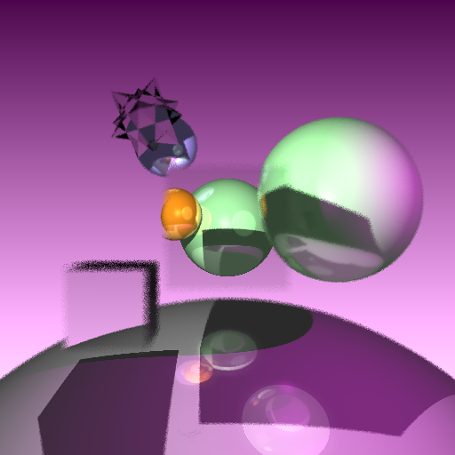
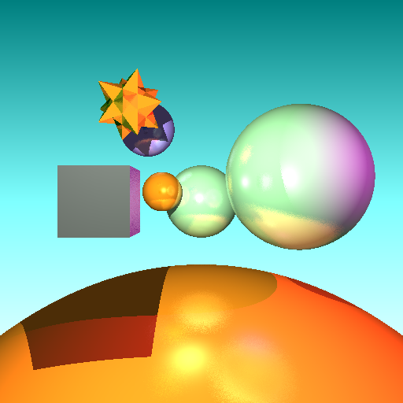
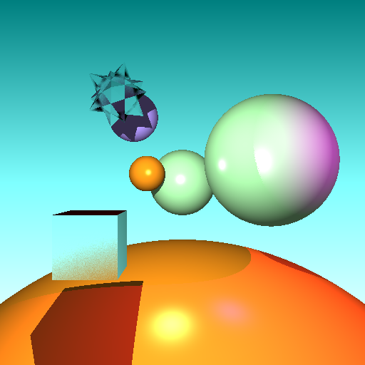
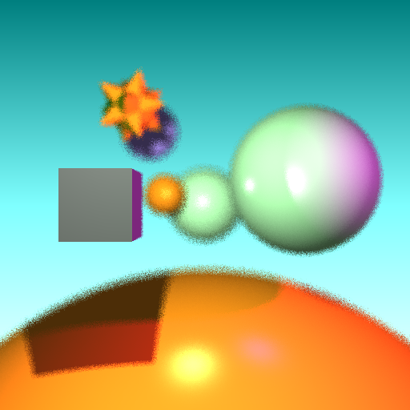
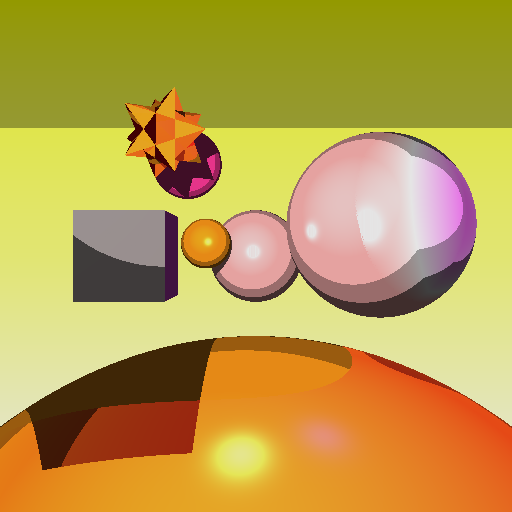
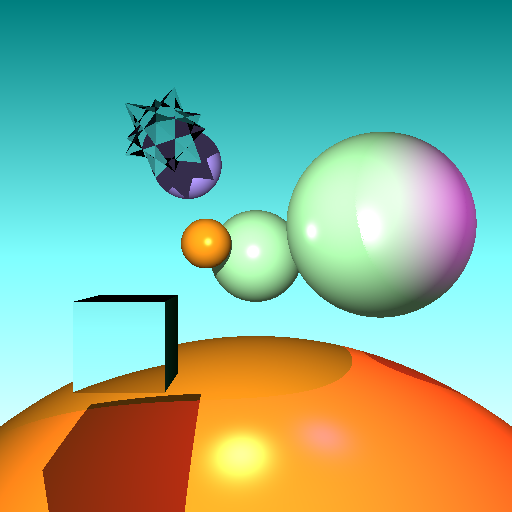
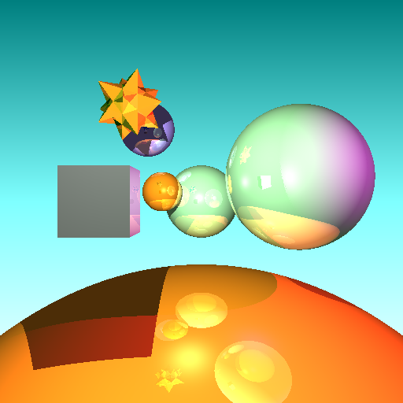
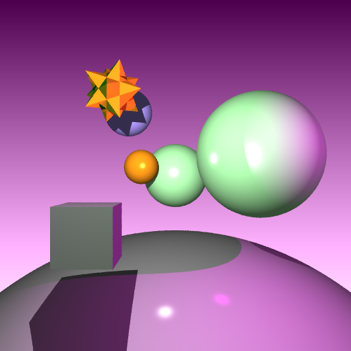

# Examples

## Multiple Features:

This scene uses a square shaped lens to focus the depth of field light rays and converge them onto the viewer's eye
  
## Glossy Reflection
  
## Glossy Refraction
  
## Soft Shadows
  
## Depth of Field 
  
## Cell Shading
  
## Specular Reflection

## Specular Refraction
  
## Supersample AA
  

# Compilation and Run Requirements
- `premake4 gmake && make && cd Assets && ../A5 <FILENAME>` where filename is a lua script Assets folder
the format of a4 is used for this project.  

Requires:
- C++17
- (OpenGL Mathematics) [https://github.com/g-truc/glm]
# Manual

- Here is a list of all flags from Option.hpp. Changing flags requires recompilation
    - CELL_SHADING
    - SOFT_SHADOWS 
    - SS_ANTI_ALIASING (supersample anti aliasing)
    - DEPTH_OF_FIELD
    - SPECULAR_REFLECTION
    - GLOSSY_REFLECTION
    - SPECULAR_REFRACTION
    - GLOSSY_REFRACTION

Each flag is independent and can be combined. 
    - Note: Combining certain distributed ray features can increase render time multiplicatively.
    - Cell Shading is the only rendering flag that does not require more render time

The number of samples for Glossy Reflection, Glossy Refraction, Soft Shadows, and Depth of Field, can be changed from their respective flags in option.hpp

-The recursive depth for reflections/refractions can be changed with the NUM_RECURSIONS flag
    - The relative contribution of color between Glossy/Reflective rays can be controlled with the flags

The lens size, focal length can be changed for depth of field

The light size and number of samples can be changed for soft shadows

